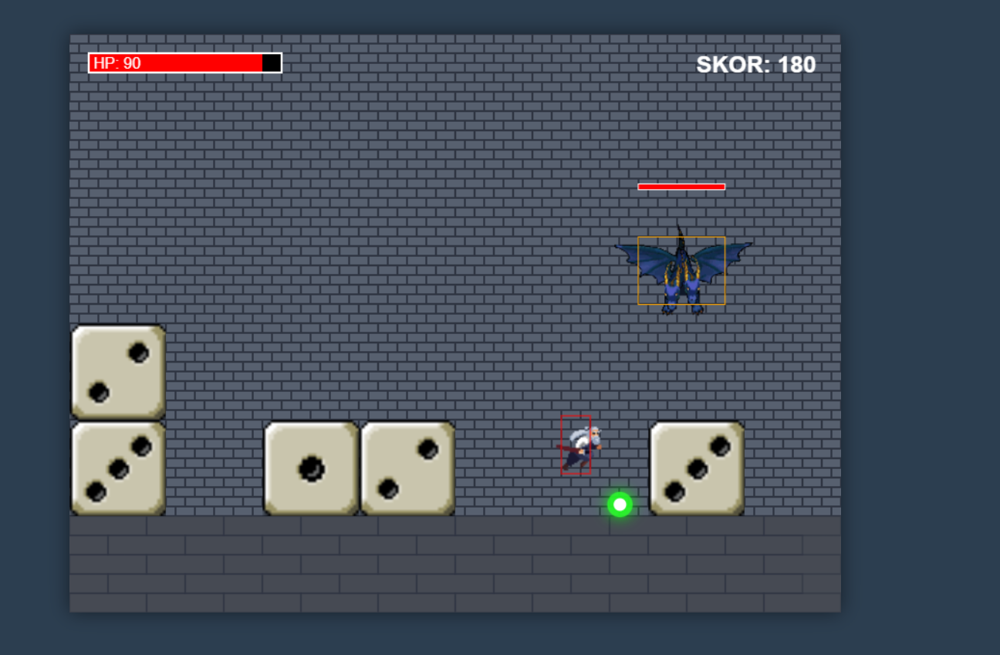
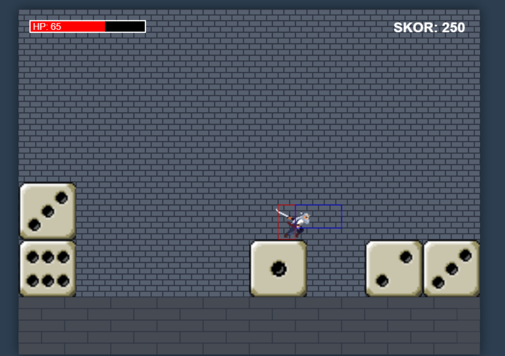

# DIEMunition 

Bu proje, Web Tabanlı Programlama dersi kapsamında HTML5, CSS ve JavaScript (Canvas API) kullanılarak geliştirilmiş bir hayatta kalma (survival) ve aksiyon oyunudur. 

## Esinleinilen Oyun Linki : (https://jamadoo-games.itch.io/diemunition)
## Oyunun Linki : (https://alperen-yazilim.github.io/Web-Tabanli-Proje-Odevi/)

## 🎮 Oyunun Amacı ve Zorluk (Challenge)
Oyuncunun amacı, gökyüzünden sürekli yağan zarların altında ezilmekten kurtulmak ve bir yandan da akın akın gelen ejderhaları yok ederek hayatta kalmaktır. Gökten düşen zarlar sadece bir engel değil, aynı zamanda shuriken fırlatabilmek için üzerine çıkılması gereken cephane platformlarıdır. 

Skor 2000'e ulaştığında devasa **Altın Ejderha (Boss)** sahneye iner. Boss'u alt eden oyuncu oyunu kazanır.

## ⌨️ Kontroller
* **A / D:** Sağa ve Sola Yürüme
* **W:** Zıplama
* **Space (Boşluk):** Kılıç Savurma (Yakın Dövüş - 100 Hasar)
* **Mouse Sol Tık:** Shuriken Fırlatma (Uzak Dövüş - Sadece içinde cephane/sayı olan bir zarın üzerindeyken yapılabilir!)

## 🖼️ Ekran Görüntüleri

## 🤖 Yapay Zeka Kullanımı
Bu projenin kodlama ve hata ayıklama süreçlerinde yapay zeka araçlarından (Copilot,Gemini,ChatGpt,Claude) faydalanılmıştır. Alınan destek, kullanılan promptlar ve cevaplar detaylı olarak repo içerisindeki [AI.md](AI.md) dosyasında belgelenmiştir.

## 🎵 Kaynaklar ve Varlıklar (Assets)
Projede kullanılan ve tarafıma ait olmayan görsel ve ses varlıklarının kaynakları aşağıdadır:
* **Müzik ve Ses Efektleri:** [Pixabay](https://pixabay.com) / [sfxr.me](https://sfxr.me) 
* **Karakter Görselleri:** (https://xzany.itch.io/samurai-2d-pixel-art)
* **Ejderha Görselleri** (https://opengameart.org/content/flying-dragon-rework)
* **Zarlar** (https://opengameart.org/content/pixel-art-dice-faces)
* **Shuriken** (https://www.pngfind.com/mpng/bJToix_shuriken-pixel-image-editor-logo-hd-png-download/)
* **Alev Topu** (https://opengameart.org/content/fireball-spell)

